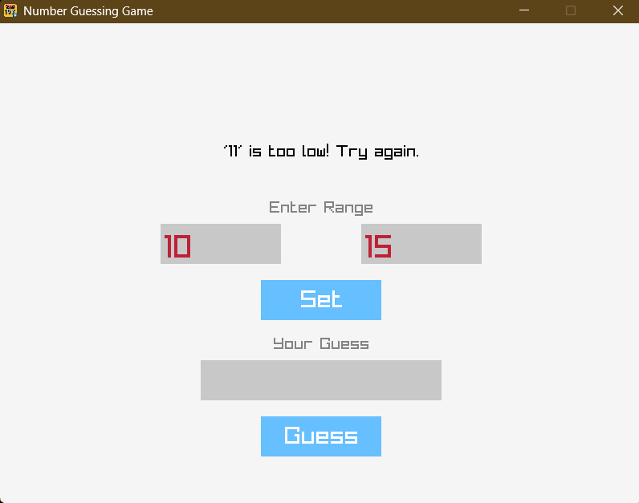

# Number Guessing Game in C with Raylib

A classic number guessing game built with C and the Raylib library, featuring a clean graphical user interface.

 


---

## About The Project

This project is a simple, beginner-friendly implementation of a number guessing game. Instead of running in a console, it uses the Raylib library to create a full graphical user interface (GUI). The player sets a minimum and maximum range, and the computer generates a secret number. The player then guesses numbers until they find the correct one, receiving feedback for each guess.

This project was created as a learning exercise to understand:
* Basic C programming
* GUI development with Raylib
* Game state management
* Handling user input for a graphical application

---

## Features

* **Graphical User Interface:** A clean and simple UI built with Raylib.
* **Customizable Range:** Players can define the minimum and maximum numbers for the guessing range.
* **Interactive Feedback:** The game provides "Too high!" or "Too low!" feedback for each incorrect guess.
* **Win Screen:** A congratulatory screen appears when the player guesses correctly.
* **Play Again:** Players have the option to start a new round without restarting the application.

---

## Built With

* [C](https://en.wikipedia.org/wiki/C_(programming_language)) - The core programming language.
* [Raylib](https://www.raylib.com/) - A simple and easy-to-use library for game and graphics programming.
* [GCC (MinGW-w64)](https://www.mingw-w64.org/) - The compiler used for the Windows build.

---

## Getting Started

To get a local copy up and running, follow these simple steps.

### Prerequisites

You will need a C compiler and the Raylib library. The recommended setup for Windows is using GCC via MSYS2.

1.  **Install Compiler (MSYS2 & MinGW-w64):**
    * Go to the [MSYS2 website](https://www.msys2.org/) and follow the installation instructions.
    * Open the MSYS2 terminal and install the 64-bit GCC toolchain by running:
        ```sh
        pacman -S --needed base-devel mingw-w64-ucrt-x86_64-toolchain
        ```
    * Add the compiler to your Windows PATH. The default location is `C:\msys64\ucrt64\bin`.

2.  **Download Raylib:**
    * Go to the [Raylib GitHub Releases page](https://github.com/raysan5/raylib/releases).
    * Download the appropriate archive for your compiler. For this setup, you need **`raylib-[version]_win64_mingw-w64.zip`**.

### Installation

1.  **Clone the repo:**
    ```sh
    git clone [https://github.com/your_username/your_repository_name.git](https://github.com/your_username/your_repository_name.git)
    ```

2.  **Set up the project folder:**
    * Navigate into the cloned repository.
    * Extract the Raylib archive you downloaded. Rename the extracted folder to `raylib` and place it in the project's root directory.
    * Your final folder structure should look like this:
        ```
        your_repository_name/
        ├── raylib/
        │   ├── include/
        │   └── lib/
        ├── src/
        │   ├── main.c
        │   └── game.c
        └── README.md
        ```

3.  **Compile the game:**
    * Open a terminal in the project's root directory.
    * Run the following command to compile the game. This will create an executable in a `build` folder.
        ```sh
        gcc -o build/game.exe src/*.c -I raylib/include -L raylib/lib -lraylib -lopengl32 -lgdi32 -lwinmm -static
        ```
    * *(Note: The `-static` flag helps bundle the necessary libraries into the executable.)*

4.  **Run the game:**
    ```sh
    ./build/game.exe
    ```

---

## How to Play

1.  **Welcome Screen:** Click the "Let's Play!" button to start.
2.  **Set Range:** On the game screen, enter the minimum and maximum numbers for your desired guessing range and click "Set".
3.  **Guess:** Type your guess into the guess box and click the "Guess" button.
4.  **Feedback:** The game will tell you if your guess is too high or too low.
5.  **Win:** When you guess the correct number, a "Congratulations!" screen will appear.
6.  **Play Again:** Click the "Play Again?" button to start a new round with the same range.

---

## License

Distributed under the MIT License. See `LICENSE` for more information.

*(You should create a file named `LICENSE` in your repository and put the text of the MIT license in it.)*

---

## Acknowledgments
* A huge thank you to [Ramon Santamaria (@raysan5)](https://github.com/raysan5) for creating and maintaining the amazing Raylib library.